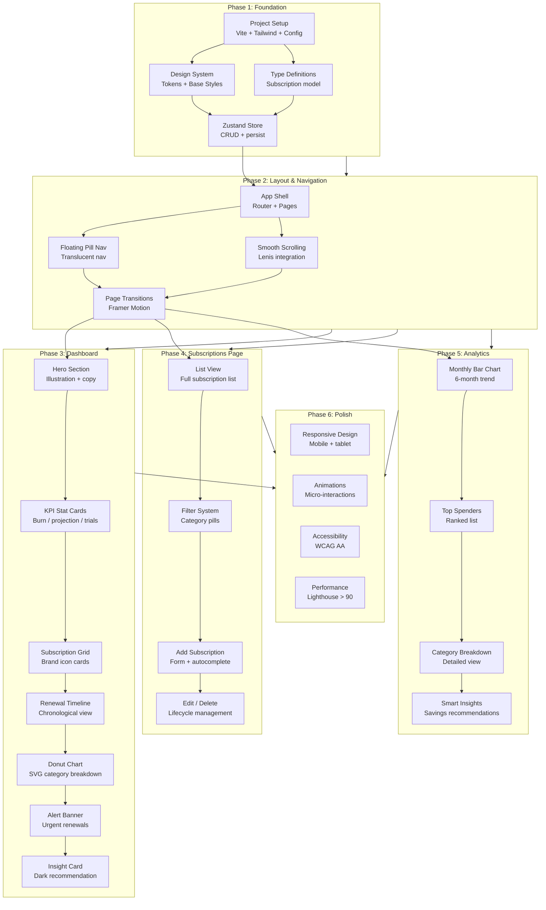
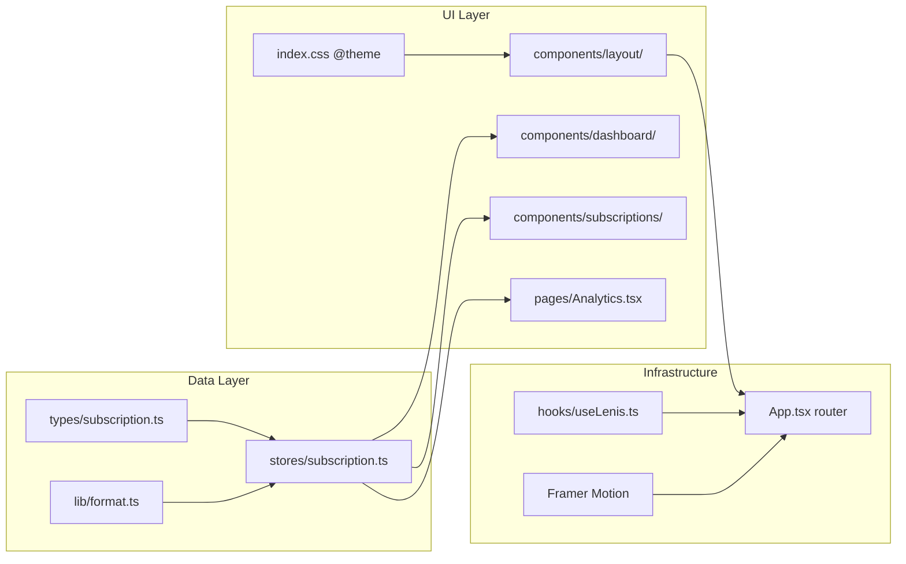
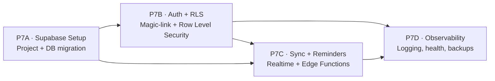
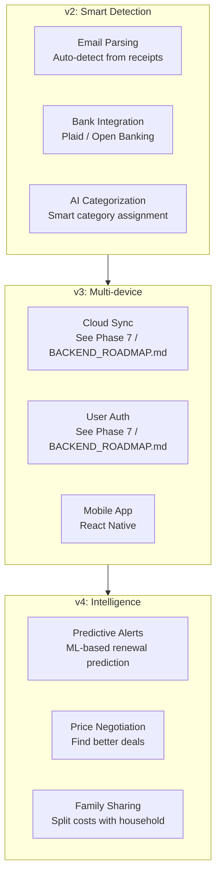

# Recall — Task Breakdown

> Implementation plan organized in phases with dependencies, estimates, and visual flow.

> **Status:** Phases 1–6 are implemented and shipping. The codebase is organized
> as a monorepo with `frontend/` (React SPA), `backend/` (Express + lowdb,
> **dev-only** — see [BACKEND_ROADMAP.md](BACKEND_ROADMAP.md)), `e2e/`
> (Playwright tests), and `docs/`.
>
> **Phase 7 (Sync plan + Supabase cloud migration)** is the next major block of
> work. It is fully scoped in [BACKEND_ROADMAP.md](BACKEND_ROADMAP.md);
> this file mirrors the phase structure only. The cloud backend has pivoted
> from "self-managed SQLite/Postgres + roll-your-own-auth" to **Supabase**
> (hosted Postgres, built-in Auth + RLS, Realtime, Edge Functions).
>
> Known deltas from the original plan: analytics components live inline in
> `frontend/src/pages/Analytics.tsx` (no `components/analytics/` directory);
> date helpers live in `frontend/src/lib/format.ts` (there is no `lib/dates.ts`);
> the 6-month trend bar chart (P5A) is deferred because a local-first v1 stores
> no spending history; provider autocomplete (P4C) is not yet built.
>
> Cross-cutting additions shipped after the original plan: a feature-flag
> module at `frontend/src/lib/featureFlags.ts` (`FLAGS.syncPlan`,
> `FLAGS.mobileApp`), an entitlements module at
> `frontend/src/lib/entitlements.ts` (`hasSync`, `hasMobile`, `tierLabel`),
> a `tier` field on the backend `AccountRecord` and frontend `UserProfile`
> with a `version: 2` Zustand migration, a `POST /api/account/upgrade` stub
> on the backend, and a copy contract at
> `frontend/src/lib/copyContract.ts` that pins the hero headline, CTAs, and
> feature trio so the E2E suite and component stay in lockstep.
>
> Design tokens (`--radius-sm/md/lg/xl/pill`) are defined in
> `frontend/src/index.css` and used consistently across all components.
> The `rounded-[Npx]` anti-pattern has been eliminated.

## Phase Overview

## Dependency Matrix

---

## Phase 1: Foundation

### P1A — Project Setup
- [x] Initialize Vite + React + TypeScript
- [x] Install dependencies (zustand, framer-motion, lenis, react-router, date-fns, recharts, lucide-react, tailwindcss)
- [ ] Configure Tailwind CSS 4 with design tokens
- [ ] Configure path aliases (`@/` → `src/`)
- [ ] Set up ESLint + Prettier
- [ ] Create `tsconfig.json` with strict mode

### P1B — Design System
- [ ] Create `src/index.css` with Tailwind directives + custom properties
- [ ] Define color tokens as CSS variables
- [ ] Define typography scale
- [ ] Define spacing scale
- [ ] Define border radius tokens
- [ ] Define shadow tokens

### P1C — Type Definitions
- [ ] Create `src/types/subscription.ts`
- [ ] Define `Subscription` interface
- [ ] Define `Category` type
- [ ] Define `BillingCycle` type
- [ ] Define `SubscriptionStatus` type

### P1D — Zustand Store
- [ ] Create `src/stores/subscription.ts`
- [ ] Implement `addSubscription()`
- [ ] Implement `updateSubscription()`
- [ ] Implement `removeSubscription()`
- [ ] Implement `getUpcomingRenewals(days)`
- [ ] Implement `getMonthlySpend()`
- [ ] Implement `getByCategory()`
- [ ] Configure `persist` middleware with localStorage
- [ ] Seed with demo data (16 subscriptions)

---

## Phase 2: Layout & Navigation

### P2A — App Shell
- [ ] Create `src/App.tsx` with React Router
- [ ] Define routes: `/`, `/subscriptions`, `/analytics`
- [ ] Create page components as route wrappers
- [ ] Set up 404 handling

### P2B — Floating Pill Nav
- [ ] Create `src/components/layout/FloatingNav.tsx`
- [ ] Implement translucent pill with backdrop-blur
- [ ] Logo, links, avatar
- [ ] Active state detection via `useLocation`
- [ ] Click handlers for page navigation

### P2C — Smooth Scrolling
- [ ] Create `src/hooks/useLenis.ts`
- [ ] Initialize Lenis with RAF loop
- [ ] Clean up on unmount
- [ ] Configure smooth scroll behavior

### P2D — Page Transitions
- [ ] Create `src/components/layout/PageTransition.tsx`
- [ ] Wrap routes in `AnimatePresence`
- [ ] Fade + Y-slide animation
- [ ] Exit before enter

---

## Phase 3: Dashboard

### P3A — Hero Section
- [ ] Create `src/components/dashboard/Hero.tsx`
- [ ] Headline with bold keywords
- [ ] Subtext
- [ ] UnDraw illustration (inline SVG)
- [ ] Decorative background circle

### P3B — KPI Stat Cards
- [ ] Create `src/components/dashboard/StatCard.tsx`
- [ ] Label (uppercase, muted)
- [ ] Value (large, split bold/light)
- [ ] Subtext
- [ ] Trend tag (up/down with color)

### P3C — Subscription Grid
- [ ] Create `src/components/dashboard/SubscriptionCard.tsx`
- [ ] Brand icon in tinted container
- [ ] Name, plan, renewal date
- [ ] Price with cycle suffix
- [ ] Cancel action link

### P3D — Renewal Timeline
- [ ] Create `src/components/dashboard/RenewalTimeline.tsx`
- [ ] Date column (day + month)
- [ ] Colored dot (Rausch for urgent)
- [ ] Name + amount
- [ ] Cancel action

### P3E — Donut Chart
- [ ] Create `src/components/dashboard/DonutChart.tsx`
- [ ] SVG circles with `stroke-dasharray`
- [ ] Center label
- [ ] Legend below

### P3F — Alert Banner
- [ ] Create `src/components/dashboard/AlertBanner.tsx`
- [ ] Dark background with pulsing dot
- [ ] Renewal count + details
- [ ] Dismiss button

### P3G — Insight Card
- [ ] Create `src/components/dashboard/InsightCard.tsx`
- [ ] Dark background
- [ ] Spending insight text with bold highlights
- [ ] CTA link to analytics

---

## Phase 4: Subscriptions Page

### P4A — List View
- [ ] Create `src/components/subscriptions/SubscriptionList.tsx`
- [ ] Render all subscriptions from store
- [ ] Brand icon, name, category, amount, renewal date
- [ ] Status indicator (active/paused/cancelled)

### P4B — Filter System
- [ ] Create `src/components/subscriptions/FilterBar.tsx`
- [ ] Category pills (All, Entertainment, etc.)
- [ ] Count badges
- [ ] Active state styling

### P4C — Add Subscription
- [ ] Create `src/components/subscriptions/AddSubscriptionModal.tsx`
- [ ] Form fields: name, amount, cycle, category, dates
- [ ] Smart autocomplete for common providers
- [ ] Validation
- [ ] Submit to store

### P4D — Edit / Delete
- [ ] Edit form (reuse Add form with pre-filled values)
- [ ] Delete confirmation
- [ ] Status toggle (active/paused)

---

## Phase 5: Analytics

### P5A — Monthly Bar Chart
- [ ] Create `src/components/analytics/MonthlyChart.tsx`
- [ ] Recharts `BarChart` with 6 months
- [ ] Custom bar colors (Rausch gradient)
- [ ] Current month highlighted

### P5B — Top Spenders
- [ ] Create `src/components/analytics/TopSpenders.tsx`
- [ ] Ranked list with brand icons
- [ ] Amount + percentage of total

### P5C — Category Breakdown
- [ ] Create `src/components/analytics/CategoryBreakdown.tsx`
- [ ] Category rows with colored dots
- [ ] Amount + percentage

### P5D — Smart Insights
- [ ] Create `src/components/analytics/SmartInsights.tsx`
- [ ] Detect duplicate categories (multiple streaming services)
- [ ] Calculate potential savings
- [ ] Recommendation card

---

## Phase 6: Polish

### P6A — Responsive Design
- [ ] Mobile nav collapse (hamburger menu)
- [ ] Single-column grid on mobile
- [ ] Reduced padding on tablet
- [ ] Touch target sizes (44px minimum)

### P6B — Animations
- [ ] Card hover micro-interactions
- [ ] Stat counter count-up on mount
- [ ] Page transition refinement
- [ ] Alert banner entrance animation

### P6C — Accessibility
- [ ] ARIA labels on all interactive elements
- [ ] Focus visible styles
- [ ] Keyboard navigation
- [ ] Screen reader testing
- [ ] Color contrast verification

### P6D — Performance
- [ ] Lazy load route components
- [ ] Optimize bundle size
- [ ] Lighthouse audit > 90
- [ ] Image optimization (inline SVGs)

---

## Phase 7: Sync plan + Supabase cloud migration

> **Source of truth for this phase lives in
> [BACKEND_ROADMAP.md](BACKEND_ROADMAP.md).** This section mirrors the phase
> structure only — scope, acceptance criteria, and effort estimates are in the
> roadmap.
>
> The cloud backend has pivoted from "lowdb → SQLite → self-managed Postgres +
> roll-your-own-auth + roll-your-own-mailer" to **Supabase**, which provides
> all of those as built-in features. Each workstream is still a separate,
> reviewable PR.

### P7A — Supabase Setup + Database
- [ ] Create Supabase project (free tier for dev; Pro tier for production)
- [ ] Install `@supabase/supabase-js` in `frontend/` and `backend/`
- [ ] Create `frontend/src/lib/supabaseClient.ts` (browser client with anon key)
- [ ] Create `backend/src/supabaseClient.ts` (service role + user-context clients)
- [ ] Write `supabase/migrations/001_init.sql` (accounts + subscriptions tables mirroring current `AccountRecord` / `SubscriptionRecord`)
- [ ] Write `supabase/migrations/001_init.sql` triggers for `updated_at` auto-timestamp
- [ ] Enable Realtime publication on `accounts` and `subscriptions`
- [ ] Add `SupabaseAdapter` to `backend/src/db.ts` alongside `LowDbAdapter` (switch via `DB_BACKEND` env var)
- [ ] One-time backfill script: `backend/data/recall.json` → Supabase Postgres
- [ ] Add `SUPABASE_URL`, `SUPABASE_ANON_KEY` to `.env.example` (frontend + backend); `SUPABASE_SERVICE_ROLE_KEY` to backend `.env.example` only
- [ ] All existing Vitest validation tests pass unchanged
- [ ] Concurrent-write stress test: 50 parallel `POST`s via Supabase adapter → 50 distinct rows
- [ ] `npm run dev` with `DB_BACKEND=lowdb` — no regression

### P7B — Auth + Row Level Security
- [ ] Enable Supabase Auth with magic link (OTP) as sole login method
- [ ] Frontend: `useAuth` hook wrapping `signInWithOtp`, `verifyOtp`, `getSession`, `onAuthStateChange`
- [ ] Frontend: update `useApiSync` to send `Authorization: Bearer <jwt>` on every API call
- [ ] Frontend: add login/verify screens to Onboarding flow (or new `/login` route)
- [ ] Backend: `requireAuth` middleware in `backend/src/auth.ts` — verify JWT via `supabase.auth.getUser(token)`, attach `req.user`
- [ ] Backend: forward user JWT to Supabase for RLS-protected queries
- [ ] RLS policies on `accounts` and `subscriptions` (users see/modify only their own data)
- [ ] Add `role` column to `accounts` (`'user' | 'admin'`) for future dev dashboard
- [ ] Endpoint tests: valid JWT, invalid JWT, no JWT, cross-tenant access denied
- [ ] Local-first fallback: frontend works offline when backend unreachable (no regression)

### P7C — Sync + Reminders
- [ ] Frontend: `useRealtimeSync` hook subscribing to `postgres_changes` on subscriptions/accounts filtered by `account_id`
- [ ] Frontend: Realtime updates mutate Zustand stores in-place; UI stays reactive
- [ ] Frontend: local-first fallback — if Realtime disconnects, mutations still write to Zustand + localStorage, sync on reconnect
- [ ] Supabase Edge Function `send-reminders`: cron-triggered every 5 min, queries due reminders, sends email, writes to `reminders` table for dedup
- [ ] `supabase/migrations/003_reminders.sql`: `reminders` table with unique dedup constraint
- [ ] RLS policy on `reminders` (users can view own reminders only)
- [ ] Daily digest Edge Function (optional; opt-in summary email at 9am)
- [ ] Flip `FLAGS.syncPlan = true` once reminder delivery is live end-to-end
- [ ] Two browser tabs signed in as same user → real-time sync within 2 seconds

### P7D — Observability + Ops
- [ ] Replace `console.*` with `pino` structured logging in Express backend
- [ ] Add `/api/health/deep` checking Supabase connectivity + Edge Function status
- [ ] Document Supabase built-in daily backups (Pro tier) in `RUNBOOK.md`
- [ ] Add manual `pg_dump` backup script (Supabase CLI) for free tier
- [ ] `Dockerfile` + `docker-compose.yml` for one-command local prod-like runs (Express + `supabase start`)
- [ ] Write `RUNBOOK.md`: rollback migration, restore from backup, log reading, key rotation, Edge Function deployment
- [ ] **Remove the `ALLOW_DEV_BACKEND=1` production kill switch** once P7A–P7D are all done

### Pre-flight checklist (remove the kill switch)
- [ ] P7A done — Supabase Postgres is the production data source; lowdb not used in production
- [ ] P7B done — every protected route returns `401` to unauthenticated requests; RLS active
- [ ] P7C done — at least one subscription has received a real reminder email end-to-end
- [ ] P7D done — `pino` logging wired, RUNBOOK.md exists, backup verified
- [ ] Staging Supabase project (separate from production) in use for testing
- [ ] `SUPABASE_SERVICE_ROLE_KEY` stored in secrets manager (not `.env` on production host)

---

## Future Scope (Post v1)

### v2 — Smart Detection
- Email parsing for subscription receipt auto-detection
- Bank/card integration via Plaid for recurring charge detection
- AI-powered category assignment

### v3 — Multi-device
The cloud sync and authentication work for v3 is no longer aspirational — it
is the **Phase 7** workstream in this file, with the chosen stack (Supabase)
and full scope in [BACKEND_ROADMAP.md](BACKEND_ROADMAP.md). The v3 deliverable that
remains on this page is the **mobile companion app**:

- React Native mobile app (free, on-device reminders, no account, no server)
- Optional one-way import of web data when the user opts in
- Native notifications fire even when the app is closed
- Gated behind `FLAGS.mobileApp` in `lib/featureFlags.ts`

### v4 — Intelligence
- ML-based renewal prediction
- Price change alerts
- Competitor price comparison
- Family sharing and cost splitting
- Budget goals and alerts
